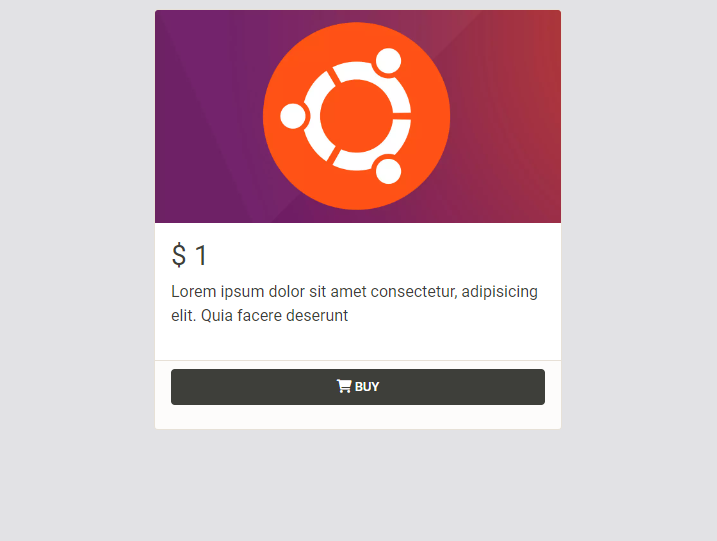
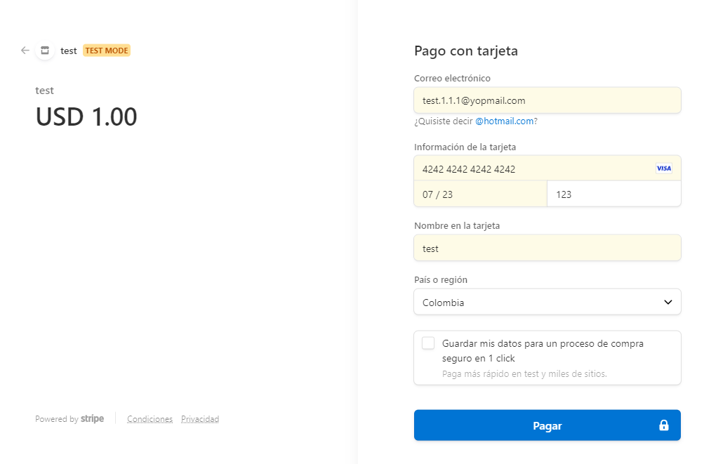
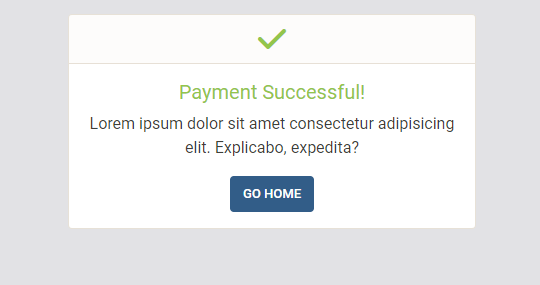
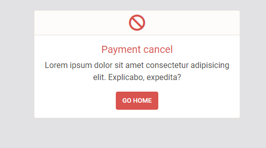

# Payments con Stripe Checkout

Ejemplo de integración con Stripe [Checkout](https://stripe.com/docs/payments/checkout).

<details open><summary>Card with an example</summary>

</details>

<details><summary>Payment</summary>

</details>

<details><summary>Success Payment</summary>

</details>

<details><summary>Cancel Payment</summary>

</details>

## How to run locally

### Requirements

* Node 14.*
* Git

**1. Clone and configure the sample**

Clone repository
```
https://github.com/EdwinAFS/Stripe-NodeJS.git
```
Install dependencies
```
npm install
```
Setting environment variables
```
cp .env.example .env
```
start
```
npm start
```

**2. Create a Product**

Create a product in [Stripe](https://dashboard.stripe.com/test/products?active=true) and copy its PRICE ID


__Note:__ You should change PRICE ID in the list of fake products

**3. Environment Variables**

```yml
PORT
STRIPE_SECRET_KEY
MY_DOMAIN
```